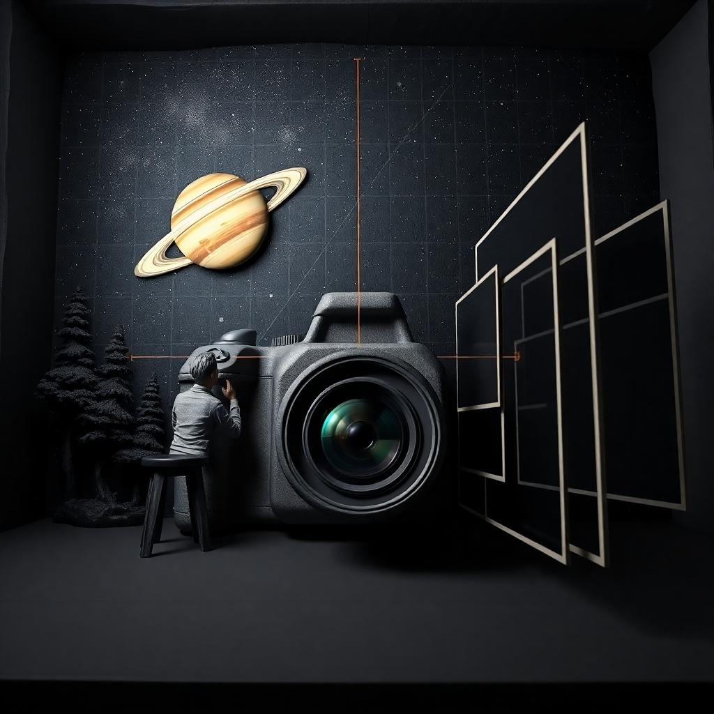

# camera-calibration

<calibration>
  
  

    Cameras capture the 3D world and record the view into a 2D image, called frame in video. 
      
    While converting the dimesion, distortion occurs and to correct it, we use 'calibration', getting camera matrix and distortion coefficients. And undistort the images with them.
      
    This Repository contains the source codes for camera calibration and image undistortion using OpenCV.
  

</calibration>

## Installation

### 1. Install the packages from the `requirements.txt`

while installing the packages, if the errors occur, please refer to ERROR_REFERENCE.md.

    
    $ python -m venv .venv
    $ source .venv/bin/activate (Mac)
      .venv\Scripts\Activate.ps1 (Windows)
    $ pip install --upgrade pip
    $ pip install -r requirements.txt
    

### 2. Install OpenCV  
The file, `requirements.txt` doesn't contain `opencv-python`. It's because we can also install it with `pip install` but for better stability to use `gstreamer`, downloading the source file from the OpenCV website and building the codes manually is recommended. The link for the source code and the guidance to use it is as follows:
    https://docs.opencv.org/4.x/da/df6/tutorial_py_table_of_contents_setup.html

## Run

run the final cell of the `ipynb file` or execute the `py file`.

### 1. to Correct the distortion of an image:
- source code: `calibration.py`
- source code with comments to understand the process: `calibration.ipynb`

### 2. to Calibrate the camera with a video file:
- source code: `calibration_with_mp4.py`
- source code with comments to understand the process: `calibration_with_mjepg.ipynb`

### 3. to record a video with a camera
- source code: `video_recording.py`
- source code with comments to understand the process: `video_recording.ipynb`